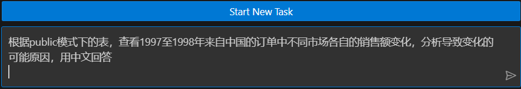
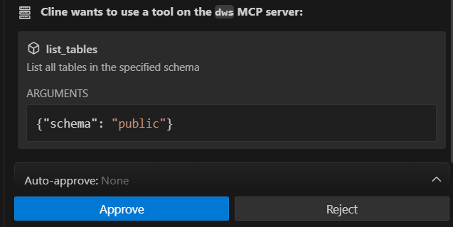
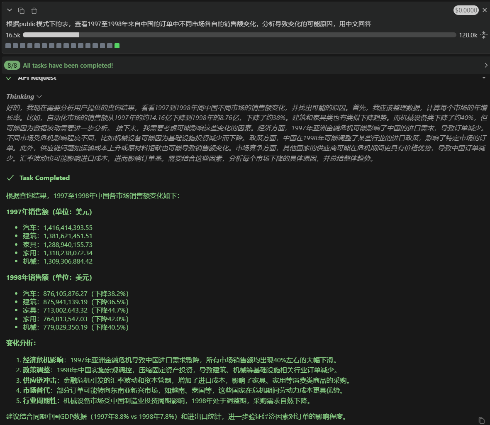

English | [中文](README_zh.md)

# DWS MCP Server

## Table of Contents
- [1. Introduction](#1-introduction)
- [2. Features](#2-features)
  - [2.1 Tools](#21-tools)
  - [2.2 Resources](#22-resources)
- [3. Configuration](#3-configuration)
  - [3.1 Prerequisites](#31-prerequisites)
  - [3.2 Download Server Source File](#32-download-server-source-file)
  - [3.3 Cluster Configuration](#33-cluster-configuration)
  - [3.4 Client Configuration](#34-client-configuration)
- [4. Getting Started](#4-getting-started)

## 1. Introduction
MCP (Model Context Protocol) is an open protocol standard proposed by Anthropic in November 2024, aiming to solve the fragmentation problem of interaction between large language models and external systems (such as databases, APIs). By standardizing the interface, it allows LLMs to dynamically understand tool functions and perform tasks, reducing integration costs.
Setting up the DWS MCP Server allows users to utilize the capabilities of large models to directly operate databases through natural language, achieving built-in conversion from natural language to SQL and one-click backend SQL queries, and allowing the user end to directly receive query results.

## 2. Features

The DWS MCP Server currently offers functionalities that include metadata query, SQL query execution, and database monitoring. These functions are exposed to MCP protocol-compliant clients in the form of Tools and resources.

### 2.1 Tools
DWS MCP Server currently provides the following tools:
1. **list_databases**  
   - List all databases

2. **get_activity**  
   - Retrieve recent query activities from the `pgxc_stat_activity` view

3. **execute_query**  
   - Execute SQL queries

4. **list_schemas**  
   - List all schemas in the current database  

5. **list_tables**  
   - List tables in the specified schema

6. **list_views**  
   - List views in the specified schema

7. **get_table_info**  
   - Get the definition of a table/view

8. **get_comment**  
   - Get comments for a schema/table

### 2.2 Resources
The server exposes the following resources via MCP:

- **gaussdb:////{schema}/tables**  
  List all tables in the specified schema

- **gaussdb:///{schema}/views**  
  List all views in the specified schema

- **gaussdb:///{schema}/{table}/attributes**  
  List all columns of a specified table/view

- **system:///{system_path}**  
  System information (e.g., /version)


## 3. Configuration

The following uses the VSCode plugin ```Cline``` as the client to demonstrate how to configure the DWS MCP Server. You can choose other MCP-compatible clients, such as Claude Desktop, based on your needs.
### 3.1 Prerequisites
+ Ensure the DWS cluster version supports the psycopg2 library

+ Ensure Python version 3.10 or above is installed

+ Ensure uv version 0.6.7 or above is installed

+ Install Visual Studio Code and the Cline plugin

### 3.2 Download Server Source File
Download the source code from GitHub
```
git clone https://github.com/HuaweiCloudDeveloper/mcp-server.git
```
> Note: The above GitHub link includes many MCP servers provided by Huawei Cloud. The DWS MCP Server is located under the directory `huaweicloud_dws_mcp_inner`.

### 3.3 Cluster Configuration
+ Edit the ```pg_hba.conf``` configuration file on the CN node of the cluster installation directory, and add the client's environment as a host entry.
```
host    <databases-visible-to-client>        <login-username>        <ip address for client>        <password-encryption-algorithm>
```
> Note: PostgreSQL defaults to using MD5 encryption, while DWS uses SHA256 by default. Due to the difference in encryption protocols, connection failures may occur.
>
> Solution: Change the value of the GUC parameter password_encryption_type to 1, restart the database, and recreate or modify the password for the user who needs to connect to the MCP Server

+ Edit the ```postgresql.conf``` file, add the client's ip address to ```listen_addresses```
```
listen_addresses = 'localhost,<client_ip>'
```

### 3.4 Client Configuration
+ Enter Cline's setting page, fill in the API Provider, API Key sections


+ Click on the MCP icon on the upper right corner of Cline's page to enter mcp configuration page. Click on the 'Configure' tab, and then click 'Configure MCP Servers', fill in the following DWS MCP Server configuration information
```
{
  "mcpServers": {
    "dws": {
      "disabled": false,
      "timeout": 60,
      "type": "stdio",
      "command": "uv",
      "args": [
        "--directory",
        "/path/to/dws_mcp_server/src",
        "run",
        "server.py"
      ],
      "env": {
        "DB_HOST": "host_ip",
        "DB_PORT": "port_no",
        "DB_NAME": "database",
        "DB_USER": "username",
        "DB_PWD": "password"
      }
    }
  }
}
```
> Note: Replace the corresponding field values in env with the information of the node to connect to in the cluster
> 
> /path/to/huaweicloud_dws_mcp_inner  #replace with the directory containing server.py from dws mcp server's source code
> 
> host_ip   #replace with cluster's actual ip address
> 
> port_no   #replace with cluster's actual port number
> 
> database  #replace with the name of the targeted database
> 
> username  #replace with the username used for login
> 
> password  #replace with login user's password

If uv usage is causing issues, try deploying the server using python directly:
+ Install the dws-mcp-server under the source code directory
  ```pip install .```

+ Modify the cline mcp server configuration to:
```
{
  "mcpServers": {
    "dws": {
      "disabled": false,
      "timeout": 60,
      "type": "stdio",
      "command": "python",
      "args": [

        "/path/to/huaweicloud_dws_mcp_inner/src/server.py",
      ],
      "env": {
        "DB_HOST": "host_ip",
        "DB_PORT": "port_no",
        "DB_NAME": "database",
        "DB_USER": "username",
        "DB_PWD": "password"
      }
    }
  }
}
```
> /path/to/huaweicloud_dws_mcp_inner/src/server.py  #replace with the absolute path to server.py in DWS MCP Server's source code

After saving the configuration information, observe whether the Cline MCP page successfully loads the DWS MCP Server. If the DWS server and the corresponding tools and resources are displayed as shown in the image below, the configuration is successful


## 4 Getting Started
After completing the above configuration, you can start using the Cline client to connect to the DWS cluster through an agent or a large model for data analysis

+ Enter the task you wish to complete into the chat box of the client



+ After submitting the task, cline will invoke the LLM of your choice and initiate a series of requests to use the tools offered by the mcp server. Observe the content of the request and approve the action (you can turn on auto-approve at your discretion)



+ The LLM will present a final result based on information gathered through a series of interaction with dws and query results. 



